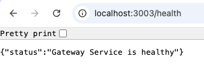

# Microservices-Task

## Overview
This document provides details on testing various services after running the `docker-compose` file. These services include User, Product, Order, and Gateway Services. Each service has its own endpoints for testing purposes.

---

## Services and Endpoints

### **User Service**
- **Base URL:** `http://localhost:3000`
- **Endpoints:**
  - **List Users:**  
    ```
    curl http://localhost:3000/users
    ```
    Or open in your browser: [http://localhost:3000/users](http://localhost:3000/users)

  - **Output**
  

---

### **Product Service**
- **Base URL:** `http://localhost:3001`
- **Endpoints:**
  - **List Products:**  
    ```
    curl http://localhost:3001/products
    ```
    Or open in your browser: [http://localhost:3001/products](http://localhost:3001/products)

  - **Output**
  

---

### **Order Service**
- **Base URL:** `http://localhost:3002`
- **Endpoints:**
  - **List Orders:**  
    ```
    curl http://localhost:3002/orders
    ```
    Or open in your browser: [http://localhost:3002/orders](http://localhost:3002/orders)

  - **Output**
  

---

### **Gateway Service**
- **Base URL:** `http://localhost:3003/api`
- **Output Health For gateway**
  
  
- **Endpoints:**
  - **Users:**  
    ```
    curl http://localhost:3003/api/users
    ```
  - **Output**
    

  - **Products:**  
    ```
    curl http://localhost:3003/api/products
    ```
    **Output**
    

  - **Orders:**  
    ```
    curl http://localhost:3003/api/orders
    ```
    **Output - Order List**
    

    **Output - Order Create Via Postman Post method**
    


---

## Instructions
1. Start all services using the `docker-compose` file:
   ```
   docker-compose up
   ```
2. Once the services are running, use the above endpoints to verify the functionality.

Happy testing!

--- 
